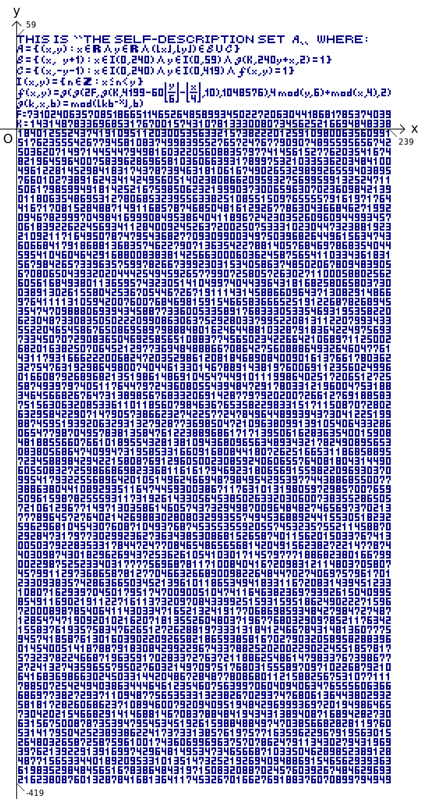

---

THIS IS 〝THE SELF-DESCRIPTION SET $A$〟 WHERE:

$A = \lbrace (x, y) : x \in R \wedge y \in R \wedge (\lfloor x \rfloor, \lfloor y \rfloor) \in B \cup C \rbrace$

$B = \lbrace (x, y + 1) : x \in I(0, 240) \wedge y \in I(0, 59) \wedge g({\mathrm K}, 240 y + x, 2) = 1 \rbrace$

$C = \lbrace (x, -y - 1) : x \in I(0, 240) \wedge y \in I(0, 419) \wedge f(x, y) = 1 \rbrace$

$I(x, y) = \lbrace n \in Z : x \le n < y \rbrace$

$f(x, y) = g(g(2 {\mathrm F}, g({\mathrm K}, 4199 - 60 \lfloor \frac{y}{6} \rfloor - \lfloor \frac{x}{4} \rfloor, 10), 1048576), 4 {\mathrm mod}(y, 6) + {\mathrm mod}(x, 4), 2)$

$g(k, x, b) = {\mathrm mod}(\lfloor k b^{-x} \rfloor, b)$

${\mathrm F} = 731024063570851866511465264858993450227206304418681785374039$

${\mathrm K} =$

```
  1431487833696853176700157431078133300807345625216694848607
270563208155416337169196351358980580604619006940957434879772
028845592243617643316119085595555875582798798158387973177961
695587578188817228313270884309874099454731913241985765682402
480224733096696517805958475042928066100949209924392429965610
551766692904047263776654396499838486398528392900895041691929
709953815043504772858511723069075303646254955446123264474132
399135568097499209716863422382789934101032731521846133868000
262329082771730906048784389387705912576097416771115812864994
198317336696101343690251839925474483575213942785063242683363
056895377315670280246764867791471907877623375038271649453182
854021185885389244374830321750777584790301153742853542800001
803212776995615125143244379356783669548607899860292215030468
372496357389687827338321380869009775183121027221622306000665
434108529937588506145256252374820685424106104653500265071429
499165977490516978768334029153298397589002274564473050238958
518723573172157176290043800440280395832035460552484762992067
849529493561574241307638065213995109640364226013296804961000
811321628352092513531339413313635921859713758236408663277002
386192216559126203984335509470259495329395180693003674481916
985784593729922914627462237255795851931055864600242532142318
674966768787359732406186007861171799850725223859636070231916
750293338790554961393908296465761510712256725042256150275961
853353038409593050154710454454971515086554776219129386191600
322844140670645385184627169239185326202513499888542720362735
998962021191766587885886375125283567616781242503845756516197
816876191710321803724279392085178759541805985378446786499999
355037854466378351524894055474084206664157675270124690002296
225319060857108132382273200584697384305825630469888977896432
560991543457042590254018585056927703776270596684379711927456
545078675187493947032274853673051855860122642712742370425853
963917860278944365922453978838483505214433388496878103399242
764407233837488918588883937087620092755170919027581059747658
687075260371020955132747315668285130611301948108509116362253
747034975626216146082065221763158722674864411736435609439600
721776130602651434691420627380848179973759206780190501532296
925802808790098781605594867546916690356299479523077404724197
946245726845183987376879398449418268922655335560612974635097
005543335638081982736279909805892964001894841686119109573543
090939336919368613186406945691544143703157025934407386944550
330246511216446769151033970189967336734074013033848520209515
918237997203937733562025438624853083446223743440168756571528
414728446749926603145457016114346065154181033867100753769439
041167254040774095432977057561464774698899066162660966140185
215017344545826901332797344178731597263993888151924585095949
592032310079010520371626665442224977109595506737417799566785
216348612593838405570128942169997754189060055948704116042801
127477452268451094379294013711634015451585382189606298412728
014051369018701118838401136494733540740703953356325628783371
453541118150965536789458775209803614635969806070635830661626
018796342020752673273787800692186347956204794348144022812339
370836117303786515553815606896168323272602756230677817295160
299954827997549085951896930123204362889275594738651705447020
323941639698395334192997012320910816923882486607439689115913
935065147563110191641773139452996426629926289613106847839879
497279568522406503816859003107052538587220753124221353664483
518844704860778218423384626452520064466203292073598028657804
094976489950291235455741425233569565297078253058387854773607
958742033328413164095843349303478827447502011163529338377924
282512905373355009689723648704956016318485168350690226970214
554064110121442985837293222421724842859785544597542309087676
231056127065035130412782484415460105782905072060734679328910
224234976659961653641143971374342378294563851212838452696539
440976148300104461171268854188854899938692788951901814055423
563988675580879375031500645546793494651069862529078359992872
398214042484623904682864685712734868941203696774466022261388
617800710778204106568476582538119303684144770652453644482942
378914919452119098364708800221922345010595494910106217845237
154021402181343119384299678932319414105519084205068519946232
617745756502372943664260390850946855181451132605067070064051
648518584235652757103867056333091068696069058723992812028933
```

---

```
$ ruby gen.rb > self-description-set.hs
$ runghc self-description-set.hs | ruby plot.rb
```

---

This was inspired by [Tupper's self-referential formula](https://en.wikipedia.org/wiki/Tupper%27s_self-referential_formula), made in 2009 [(Japanese article)](https://mametter.hatenablog.com/entry/20091106/p1).
